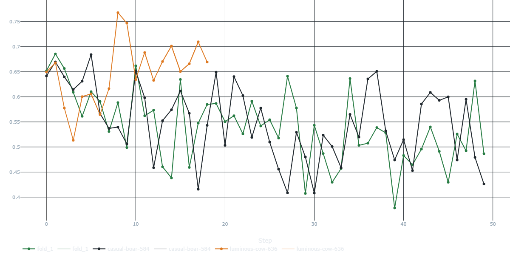
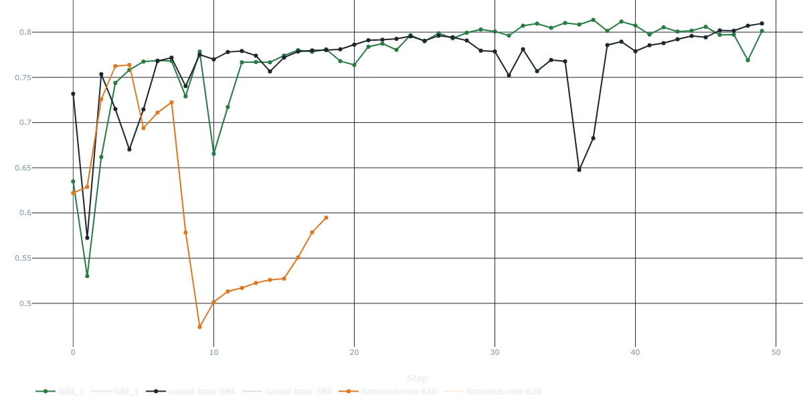

# Antifrod-sys
Проект по предсказанию утечки клиентов по истории их транзакций. 

# Описание
В датасете представлены 4 характеристики:\n
user_id - индентификатор пользователя\n
date - дата и время транзакции\n
amount - сумма и тип транзакции\n
churn - ушел ли пользователь в бинарном виде - 0/1

# Мои результаты обучения

## График потерь (Loss)

## График точности (Accuracy)

